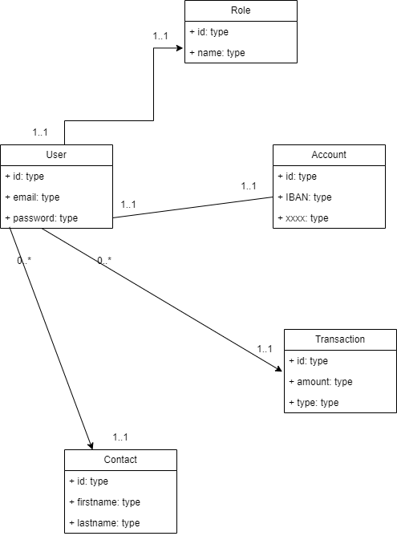

# Application Bankin

Suite tuto Udemy:

Fullstack SpringBoot Angular, dossier SprinBoot Angular Fullstack

## Introduction au projet

On va développer une application bancaire qui permet de créer un compte, effectuer un virement, ...
En ligne.
User/admin

### Concevoir le diagramme de classe (UML)

Après avoir défini le besoin et écrit un cahier des charges, on passe à la conception UML:
plusieurs phases
structure base de données

création d'un compte bancaire, qui va créer ce compte?
utilisateur
deux objets user et compte
faire virement, dépôt, ... = transaction, deux types effectuer un virement ou dépôt d'argent
relations entre ces entités?

un user a un compte, et un compte n'a qu'un seul user: one to one qui peut être bidirectionnelle
la création d'un user implique forcèment la création d'un compte

un user peut effectuer des transactions d'un user vers un autre, vers un autre compte
user aucune  à plusieurs transactions et une transaction appartient à un et un seul user

une transaction peut impliquer la création d'un contact

transaction et account, un user lorsqu'il veut faire une transaction on peut indiquer quel est le compte qu'on veut utiliser

admin table rôle unidirectionnelle one to one

[UML](https://app.diagrams.net/#G1PauvmcU0DnYJ39csDpcpWW08FOW-AREq)

## Mise en place du projet

### Créer un nouveau projet avec les dépendances nécessaires

Spting initializr

Spring Web WEB
Build web, including RESTful, applications using Spring MVC. Uses Apache Tomcat as the default embedded container.
Lombok DEVELOPER TOOLS
Java annotation library which helps to reduce boilerplate code.
Spring Data JPA SQL
Persist data in SQL stores with Java Persistence API using Spring Data and Hibernate.
PostgreSQL Driver SQL
A JDBC and R2DBC driver that allows Java programs to connect to a PostgreSQL database using standard, database independent Java code.
Spring Security SECURITY
Highly customizable authentication and access-control framework for Spring applications.

### Démarrer et tester l'application

Import projet avec Maven: 
settings build Bundled (Maven 3)

application.properties => .yaml

## Spring Data et connexion à la base de données

### Configurer la base de données

### Configurer le projet et se connecter à la base de données

application.yaml

spring:
datasource:
url=jdbc:postgresql://localhost:5432/demo_db
chaîne de connexion à la bdd

Ajout dépendance spring data jpa:
spring-boot-starter-data-jpa

configuration supplémentaire pour jpa:

jpa:
hibernate:
ddl-auto:
définition du comportement, de Spring application vis à vis de la bdd.
ddl-auto au démarrage de l'application ce que je veux faire avec la bdd.
create pour créer le schéma et supprimer les données précédentes
create drop permet de créer et ensuite détruire le schéma à la fin de la session
validate s'il manque un attribut dans une ou une partie(classe/table)

Pour nous create phase de développement
>Spring Data JPA fournit l'interface JpaRepository<T, ID> qui hérite de CrudRepository<T, ID> et qui fournit un ensemble de méthodes plus spécifiquement adaptées pour interagir avec une base de données relationnelle. Pour définir un repository, il suffit de créer une interface qui hérite d'une des interfaces ci-dessus.

>JPA fournit de nombreuses autres annotations et API pour définir des mappages objet-relationnels, gérer les entités, exécuter des requêtes et gérer les transactions. En utilisant JPA, vous pouvez écrire du code Java qui interagit avec une base de données à l'aide d'une API de haut niveau, sans avoir à écrire de code SQL de bas niveau.

Démarrer application.

    spring:
        datasource:
            url: jdbc:postgresql://localhost:5432/demo_db
            driver-class-name: org.postgresql.Driver
            username: postgres
            password: root
    jpa:
        hibernate:
            ddl-auto: create
            database: postgresql
            database-platform: org.hibernate.dialect.PostgreSQLDialect

Initialized JPA EntityManagerFactory for persistence unit 'default' => crée un entity manager pour l'unité de persistance default

**JDBC**

    package com.vandingenen.banking.models;

    import jakarta.persistence.*;
    
    @Entity
    public class Student {
    
        @Id
        @GeneratedValue
        private Integer id;
    
        private String firstname;
    
        private String lastname;
    
    }

### @Entity

Spécifie que la classe est une **entité persistante**:
représentation du code d'une table dans la BDD.
On dit à hibernate que c'est une représentation de la table, Spring trouve @Entity, il considère cette classe comme une entité et se base sur la confi de application.yaml et en fera ce qui est indiqué

### @Table

Au démarrage de l'application, Spring va scanner tous les composants, @Entity le nom de table est le nom de la classe.
Mais si l'on veut préciser un autre nom pour la table: **@Table**.

### @Id

Pour la primary key d'une entité.
Au niveau méthode ou field.
Obligatoire, doit être déclarée.

### @GeneratedValue

Annotation Id => génération automatique des Id.
Indiquer à Hibernate que la valeur est auto-générée.
Il va déterminer automatiquement générer les stratégies de génération pour les clés primaires simples (pas les clés primaires dérivées.
Fonctionne avec @Id de l'entité ou de la classe mère.

(exemple:@GeneratedValue(strategy = GenerationType.AUTO)

### @Column

Donne plus d'informations sur l'attribut.
L'on peut spécifier un autre nom.
@Column(name = "prenom")

L'on peut ajouter si la colonne est nulle ou non, length ... 

### @OneToMany

Exemple classes Product et Category:

un id d'objet peut figurer plusieurs fois en tant que clés étrangères dans une autre entité. 1..*
Un produit appartient à une seule catégorie, et une catégorie à un ou plusieurs produits.
One category to many product.

PRODUIT 

ID | CODE | id_cat

------------------

1 | Prod 1 | 999
2 | Prod 2 | 998
3 | Prod 3 | 999 

@OneToMany toujours une liste ou collection, c'est-à-dire un tableau d'objets.

mappedBy si relation n'est pas unidirectionnelle, avec attribut dans autre entité.

    package com.vandingenen.banking.models;

    import jakarta.persistence.Entity;
    import jakarta.persistence.GeneratedValue;
    import jakarta.persistence.Id;
    import jakarta.persistence.OneToMany;
    
    import java.util.List;
    
    @Entity
    public class Category {
    
        @Id
        @GeneratedValue
        private Integer id;
    
        @OneToMany(mappedBy = "category")
        private List<Product> products;
    }

### @ManyToOne

Plusieurs produits peuvent appartenir à une seule catégorie
Avec cette annotation on doit ajouter une autre annotation pour définir le JoinColumn: colonne de jointure.

**@JoinColumn**

Quel est le nom de l'id de jointure, de la clé étrangère.

Ainsi, on peut implémenter la relation 1..*.

    package com.vandingenen.banking.models;

    import jakarta.persistence.*;
    
    @Entity
    public class Product {
    
        @Id
        @GeneratedValue
        private Integer id;
    
            private String code;
    
            @ManyToOne
            @JoinColumn(name = "id_cat")
            private Category category;
    
    }

### @OneToOne

Pour étendre une table.
Exemple, une classe student et cette personne à une adresse avec plusieurs atttributs. Cette classe peut être utilisée dans plusieurs endroits.
On peut définir une relation one to one car ne peut avoir qu'une adresse.

Relation unidirectionnelle ou bidirectionnelle?
soit on crée ou ajoute la clé étrangère d'une entité dans une autre, ou ajouter les deux clés primaires dans les deux entités.

On définit les relations, la relation soit au niveau de l'adresse, quand on crée un étudiant sa clé soit dans l'netité adresse mais pas dans étudiant.
Mapping niveau table adresse, puis définir la deuxième relation dans student

### Créer les entités

Désactivation de la dépendance security.
application.yaml configuration DB
création des models
@Builder de lombok pour générer simplement les objets, @Dtaa pour les getter et setter

    private TransactionType type;
création d'un enum, utilisation d'numération au niveau des entités, on doit mentionner à hibernate que c'est un **enum** on utilise @Enumerated(type soit ordinal pour un entier ou String )

### Ajout du mapping (relations) entre les entités

Implémentation des relations entre les objets.
Avec  @Builder on doit définir un constructeur avec paramètres, ce design pattern utilise un constructeur avec paramètres pour créer les objets.

Caused by: org.postgresql.util.PSQLException: ERREUR: erreur de syntaxe sur ou près de « user »
user nom réservé par PostGreSQL.

### Optimisation du code et ajout du JpaAuditing

Dans chaque entité un attribut id
Transaction et account create et update date, peuvent être utilisés pour toutes les entités.
On peut les extraire dans une classe:

**@MappedSuperclass**
public class AbstractEntity {
Entité ou classe qui définit des informations qui seront héritées par les classes qui vont étendre celles-ci.
Permet de rendre le code plus lisible, optimisation

@Builder avec héritage avec lombok on doit utiliser **@SuperBuilder** pour construire avec les objets hérités.

    package com.vandingenen.banking.models;

    import jakarta.persistence.Entity;
    import jakarta.persistence.GeneratedValue;
    import jakarta.persistence.Id;
    import jakarta.persistence.MappedSuperclass;
    import lombok.Builder;
    import lombok.Data;
    import lombok.NoArgsConstructor;
    import lombok.experimental.SuperBuilder;
    
    import java.time.LocalDateTime;
    
    @Data
    @NoArgsConstructor
    @SuperBuilder
    @MappedSuperclass
    public class AbstractEntity {
    
        @Id
        @GeneratedValue
        private Integer id;
    
        private LocalDateTime creationDate;
    
        private LocalDateTime lastUpdated;
    }
Dans cette classe l'on a les deux champs dates doivent être mis à jour lors de la création et de la mise à jour, les valeurs doivent être initialisées.
Hibernate a des annotations pour ce faire:

**@CreatedDate et @LastModifiedDate**

Ajout de @Column pour ajouter des informations complémentaires.

**@EntityListeners(AuditingEntityListener.class)** => pour calculer ou activer les valeurs de created et lastModified
il faut l'activer dans le main @EnableJpaAuditing. Permettra de faire appel à cette classe pour implementer ce qui est demandé.

## Implémenter les repositories

### Repository? (JpaRepository)

SpringData est un modèle de programmation basé sur Spring pour l'accès aux données. Réduction du code nécessaire pour l'accès aux DB et des data storage.
Il se compose de plusieurs modules, aussi il simplifie le développement d'application Spring qui utilise la technologie Jpas, simplifie toutre la partie accès aux données dans une application Spring.

On définit une interface de référentiel ou **repository** pour chaque entité de domaine de notre application: on crée un repository pour chacune.

Un repository contient des méthodes pour effectuer des opérations CRUD, trier et paginer des opérations CRUD (quatre opérations qui peuvent être effectuer au niveau d'une DB).
Un référentiel est créé en étendant des interfaces repository spécifiques, tels que:
- CrudRepository,
- PagingAndSortingRepository,
- JpaRepository.
Pour créer un repository, il suffit d'étendre une de ces trois interfaces.

SpringData est une intégration avancée avec les controllers Spring MVC. Il fournit une dérivation dynamique des requêtes à partir des noms de models, des noms, des méthodes de référentiels.
Simplifie la création des models ou la phase d'accès aux données en utilisant le **SDP**: SpringDataPattern.

### Spring Data Pattern

Spring a le pouvoir de comprendre et générer la requête à partir du nom d'une méthode.
En SQL select * FROM ...
Avec le SDP, on utilise findAll() 

On écrit pas de SQL.

User création de la première interface. JpaRepository, il faut créer une interface et de l'étendre par une interface Crud du repository Jpa.
Transformer cette interface en une interface ou repositoryJpa ou un référentiel d'une façon général:

public interface UserRepository extends JpaRepository{

}
Cette interface, JpaRepo prend un objet T qui est le domaine et id type de l'id:
JpaRepository<T, ID>
On a transformé l'interface UserRepo vers une interface ou JpaRepository.

CrudRepository => save(), find(), ... méthodes de base crud.
Implémentation d'autres fonctionnalités via l'interface de pagingAnd avec findAll() avec sort et/ou pagination.
Jpa avec d'autres fonctionnalités.

Jointure avec STP.

## Sources

[Udemy](https://www.udemy.com/course/devenir-fullstack-spring-boot-angular-par-la-pratique/learn/lecture/33844830#reviews)